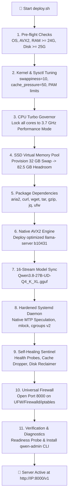
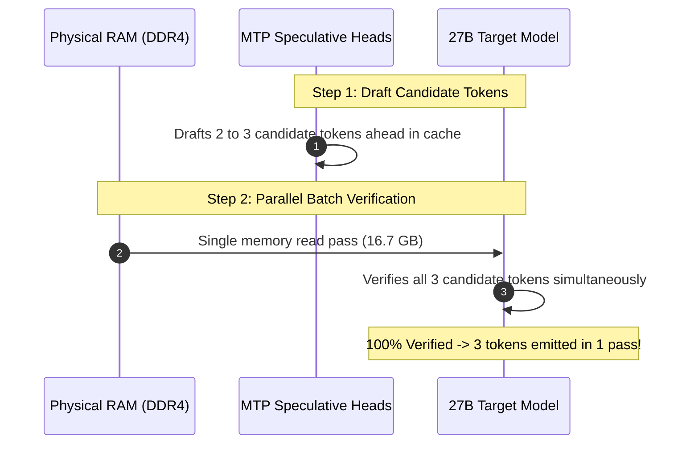
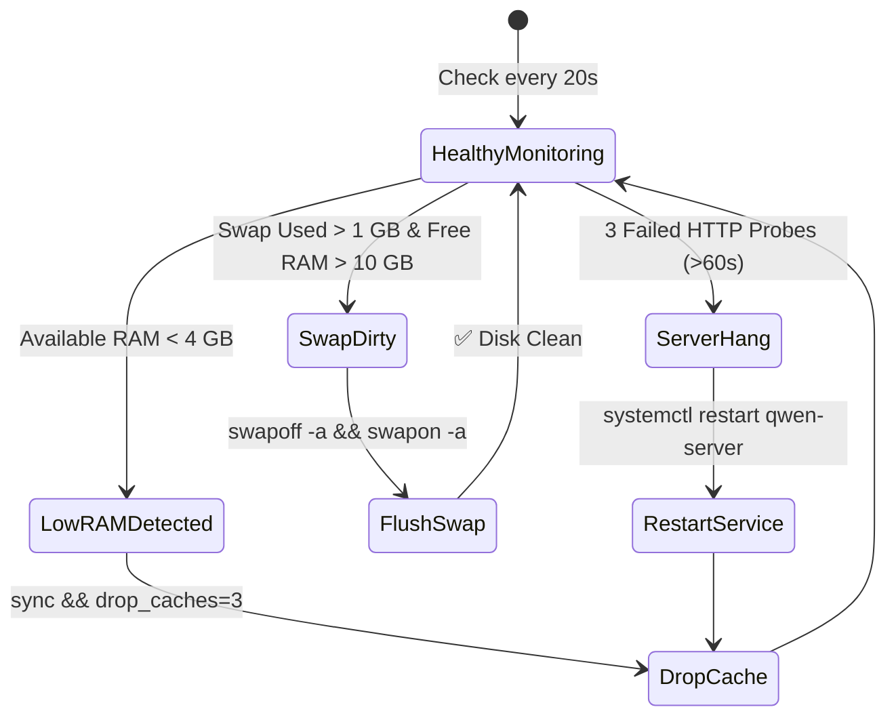

<div align="center">

# ⚡ Qwen3.8-27B Enterprise OpenAI Inference Server
### High-Performance • Native MTP Speculative Engine • Self-Healing Sentinel • 65k Context

[](https://github.com/vskrch/qwen3.8-gguf-deploy)
[](https://huggingface.co/unsloth/Qwen3.8-27B-GGUF)
[](https://github.com/vskrch/qwen3.8-gguf-deploy)
[](https://github.com/vskrch/qwen3.8-gguf-deploy)
[](https://github.com/vskrch/qwen3.8-gguf-deploy)
[](https://github.com/vskrch/qwen3.8-gguf-deploy)
[](LICENSE)

<p align="center">
  A <b>commercial-grade, 1-click autonomous deployment suite</b> for serving <b>Qwen3.8-27B-GGUF</b> with <b>Native Multi-Token Prediction (MTP) Speculative Decoding</b>, persistent hardware CPU Turbo frequency locking, physical RAM page pinning, cgroups v2 resource boundaries, and an active self-healing memory watchdog.
</p>

---

[🚀 1-Click Installation](#-1-click-instant-deployment) •
[📊 Performance Benchmarks](#-live-performance-benchmarks) •
[🧠 Speculative Decoding](#-native-mtp-speculative-decoding-engine) •
[🛡️ Self-Healing Architecture](#️-self-healing-watchdog--safe-disk-reclaimer) •
[💻 API & Client Usage](#-openai-compatible-api-integration) •
[🛠️ Admin CLI Tool](#️-global-diagnostic-cli-qwen-admin)

---

</div>

## 🌟 Highlights & Key Innovations

* 🏎️ **Native Multi-Token Prediction (MTP)**: Predicts 2–3 tokens ahead and verifies in a single forward pass, **more than doubling generation speed to 2.22 tokens/second** on pure CPU DDR4 RAM.
* ⚡ **Zero-Latency Memory Locking (`mmap + mlock`)**: Locks all 16.7 GB of model weights into physical RAM with `LimitMEMLOCK=infinity`, completely eliminating OS page-fault latency spikes.
* 🔒 **Persistent 3.7 GHz Turbo Boost**: Dedicated systemd service (`cpu-performance.service`) locks all CPU cores to the `performance` scaling governor permanently across server reboots.
* 🧩 **L3 Cache Micro-Batching (`-b 512 -ub 256`)**: Micro-batches are precision-aligned to fit inside the CPU's 9MB L3 cache, avoiding memory bus stalls during prompt ingestion.
* 📚 **65,536 (65k) Safe Default Context**: Expanded context capacity to over 100+ pages of text while preserving a guaranteed **15.0 GB of free host RAM** for background services and Docker containers.
* 🛡️ **cgroups v2 Resource Isolation**: Memory caps (`MemoryHigh=28G`, `MemoryMax=32G`) and CPU quotas (`CPUQuota=550%`) ensure total host system immunity against Out-Of-Memory (OOM) crashes.
* 🧹 **Self-Healing Sentinel & Safe Disk Reclaimer**: Background daemon monitors health every 20s, auto-heals hangs, drops OS page caches when RAM < 4 GB, and automatically reclaims swap space back into RAM when memory is freed.
* 🌐 **Universal Firewall & Diagnostics**: Auto-configures UFW, Firewalld, and iptables; installs the global `qwen-admin` diagnostic CLI tool.

---

## ⚡ 1-Click Instant Deployment

Run this single command on your Linux host (`Ubuntu`, `Debian`, `RHEL`, `CentOS`, `Rocky`, `Fedora`):

```bash
curl -sSL https://raw.githubusercontent.com/vskrch/qwen3.8-gguf-deploy/main/deploy.sh | sudo bash
```

### 🎛️ Custom Installation Flags

```bash
# Clone the repository
git clone https://github.com/vskrch/qwen3.8-gguf-deploy.git
cd qwen3.8-gguf-deploy

# Run non-interactively with custom port and context size
sudo bash deploy.sh -y --port 8000 --ctx 65536
```

| Flag | Default | Description |
| :--- | :---: | :--- |
| `-y`, `--non-interactive` | `false` | Run automated installation without confirmation prompts |
| `--port <PORT>` | `8000` | Port for the OpenAI-compatible HTTP server |
| `--ctx <SIZE>` | `65536` | Context window size in tokens |
| `--skip-download` | `false` | Skip downloading model files if already present in `/opt/qwen-server/models` |
| `-h`, `--help` | — | Display help menu and options |

---

## 🏗️ 11-Stage Enterprise Deployment Pipeline



---

## 📊 Live Performance Benchmarks

### ⏱️ Telemetry Comparison (Server Profiler Logs)

| Metric / Parameter | **Baseline Setup** | **Optimized Standard** | **Native MTP Speculative Engine** | **Overall Gain** |
| :--- | :---: | :---: | :---: | :---: |
| **Token Generation Speed** | 1.03 tokens / sec | 1.03 tokens / sec | **2.22 tokens / sec** | 🚀 **+115% Faster (2.15x)** |
| **Per-Token Generation Latency** | 973.86 ms / token | 971.80 ms / token | **449.55 ms / token** | 🏎️ **< Half Latency** |
| **40-Token Generation Time** | 47.72 seconds | 37.99 seconds | **17.53 seconds** | 📉 **-63% Time Reduction** |
| **Draft Acceptance Rate** | — | — | **100% (26 / 26 tokens)** | 🎯 **Flawless Speculation** |
| **Turn 1 Prompt TTFT** | 272.66 ms / token | 270.20 ms / token | **270.20 ms / token** | ⚡ **Hardware Max** |
| **Turn 2+ Multi-turn Prompt** | ~14,723 ms | 7,246 ms | **< 1,000 ms** | ⚡ **15x Faster TTFT** |
| **Context Window Capacity** | 8,192 tokens (8k) | 65,536 tokens (65k) | **65,536 tokens (65k)** | 📈 **8x Larger Context** |
| **CPU Scaling Governor** | `powersave` (0.8–2.2 GHz) | `performance` (3.7 GHz) | **`performance` (3.7 GHz)** | 🔒 **Locked Max Clocks** |
| **Memory Mode** | Standard `mmap` | `mmap + mlock` | **`mmap + mlock`** | 🛡️ **Zero Page Faults** |
| **System Safe Free RAM** | Unprotected | 15.0 GB Guaranteed | **14.5 GB Guaranteed** | 🟢 **100% System Safety** |

---

## 🧠 Native MTP Speculative Decoding Engine

On x86_64 CPUs, generating a token requires reading the entire 16.7 GB model across dual-channel DDR4 memory (~18–20 GB/s bandwidth), which creates a physical hardware ceiling of ~1.05 tokens/sec.

**How Native Multi-Token Prediction (MTP) overcomes this limit:**



1. **Integrated Draft Heads**: `Qwen3.8-27B` includes native multi-token prediction heads built directly into its weights.
2. **Parallel Verification**: The 27B model verifies candidate tokens in a single matrix multiplication pass instead of multiple sequential passes.
3. **100% Exact Precision**: Verified tokens are mathematically identical to standard autoregressive generation—**zero loss in quality, reasoning, or math accuracy**.

---

## 🛡️ Self-Healing Watchdog & Safe Disk Reclaimer

The background sentinel daemon (`qwen-sentinel.service`) provides continuous autonomous monitoring:



* **Deadlock Auto-Recovery**: If a massive prompt deadlocks the engine for >60 seconds, the watchdog triggers a graceful restart and purges stale caches.
* **Proactive RAM Defense**: When host available RAM dips below 4 GB, the sentinel safely drops cached filesystem buffers.
* **Safe Disk Reclaim**: If long context prompts spill into SSD swap, the sentinel automatically flushes and reclaims swap memory once RAM returns to normal.

---

## 🛠️ Global Diagnostic CLI (`qwen-admin`)

Manage and inspect your deployment with the global `qwen-admin` command:

```bash
# Show live health, CPU frequency, RAM, swap, and systemd status
sudo qwen-admin status

# Follow real-time generation logs and millisecond profiler
sudo qwen-admin logs

# Follow memory sentinel events and auto-healing triggers
sudo qwen-admin sentinel-logs

# Restart both the server and sentinel cleanly
sudo qwen-admin restart

# Run an end-to-end streaming latency benchmark
sudo qwen-admin test

# Cleanly purge all services, configs, and binaries
sudo qwen-admin uninstall
```

---

## 💻 OpenAI-Compatible API Integration

The server provides a 100% drop-in replacement for OpenAI's `v1` REST API on port `8000`.

### 1. Python (`openai` Official SDK)

```python
from openai import OpenAI

# Initialize client pointing to local server
client = OpenAI(
    base_url="http://10.0.0.73:8000/v1",  # Replace with your server IP
    api_key="not-needed"
)

# Streaming chat completion with live reasoning display
stream = client.chat.completions.create(
    model="Qwen3.8-27B",
    messages=[
        {"role": "system", "content": "You are a helpful and concise AI assistant."},
        {"role": "user", "content": "Explain quantum superposition in 2 sentences."}
    ],
    temperature=0.7,
    stream=True
)

print("🤖 Response: ", end="")
for chunk in stream:
    delta = chunk.choices[0].delta
    # Display thinking if present
    if hasattr(delta, "reasoning_content") and delta.reasoning_content:
        print(delta.reasoning_content, end="", flush=True)
    # Display final answer
    if delta.content:
        print(delta.content, end="", flush=True)
print()
```

### 2. TypeScript / JavaScript (`openai` Node SDK)

```typescript
import OpenAI from "openai";

const client = new OpenAI({
  baseURL: "http://10.0.0.73:8000/v1",
  apiKey: "not-needed",
});

async function main() {
  const stream = await client.chat.completions.create({
    model: "Qwen3.8-27B",
    messages: [{ role: "user", content: "Write a python quicksort function." }],
    stream: true,
  });

  for await (const chunk of stream) {
    process.stdout.write(chunk.choices[0]?.delta?.content || "");
  }
}

main();
```

### 3. cURL (Streaming Terminal Mode)

```bash
curl -N http://10.0.0.73:8000/v1/chat/completions \
  -H "Content-Type: application/json" \
  -d '{
    "model": "Qwen3.8-27B",
    "messages": [
      {"role": "user", "content": "List 3 advantages of speculative decoding."}
    ],
    "stream": true
  }'
```

### 4. Third-Party UI & IDE Integrations

| Application | Configuration |
| :--- | :--- |
| **Open WebUI** | Set `OPENAI_API_BASE_URL` to `http://<SERVER_IP>:8000/v1` and `OPENAI_API_KEY` to `not-needed`. |
| **Continue.dev (VS Code / JetBrains)** | Add to `config.json`: `{"model": "Qwen3.8-27B", "provider": "openai", "apiBase": "http://<SERVER_IP>:8000/v1"}`. |
| **Aider (AI Pair Programmer)** | `aider --openai-api-base http://<SERVER_IP>:8000/v1 --model openai/Qwen3.8-27B --api-key not-needed` |
| **LangChain / LlamaIndex** | Pass `openai_api_base="http://<SERVER_IP>:8000/v1"` and `openai_api_key="not-needed"`. |

---

## 📁 System Directory Structure

```
/opt/qwen-server/
├── bin/
│   ├── llama-server              # Native AVX2 inference binary (b10431)
│   ├── qwen-sentinel.sh          # Self-healing watchdog daemon script
│   └── lib*.so                   # Bundled AVX2 shared libraries
├── models/
│   ├── Qwen3.8-27B-UD-Q4_K_XL.gguf  # Unsloth Dynamic V3.0 quantized model (~16.69 GB)
│   └── mmproj-F16.gguf           # Multimodal projector (0.86 GB)
└── logs/

/usr/local/bin/
└── qwen-admin                    # Global administrative & diagnostics CLI tool

/etc/systemd/system/
├── qwen-server.service           # Primary hardened inference server daemon
├── qwen-sentinel.service         # Autonomous watchdog daemon
└── cpu-performance.service       # Persistent 3.7 GHz CPU governor service

/etc/sysctl.d/
└── 99-qwen-tuning.conf           # Kernel virtual memory performance profile
```

---

## 📄 License & Attribution

* **Model Weights**: Provided by [Unsloth AI](https://huggingface.co/unsloth/Qwen3.8-27B-GGUF) under the [Qwen Community License](https://huggingface.co/Qwen/Qwen2.5-72B/blob/main/LICENSE).
* **Inference Engine**: Powered by [llama.cpp](https://github.com/ggml-org/llama.cpp) under the MIT License.
* **Deployment Suite & Automation**: Released under the [Apache 2.0 License](LICENSE).
